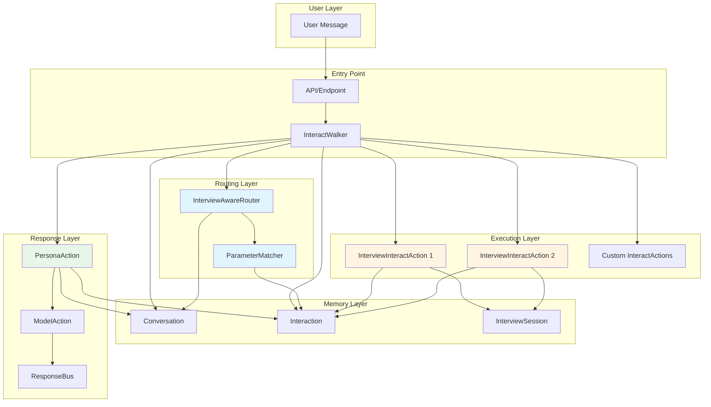
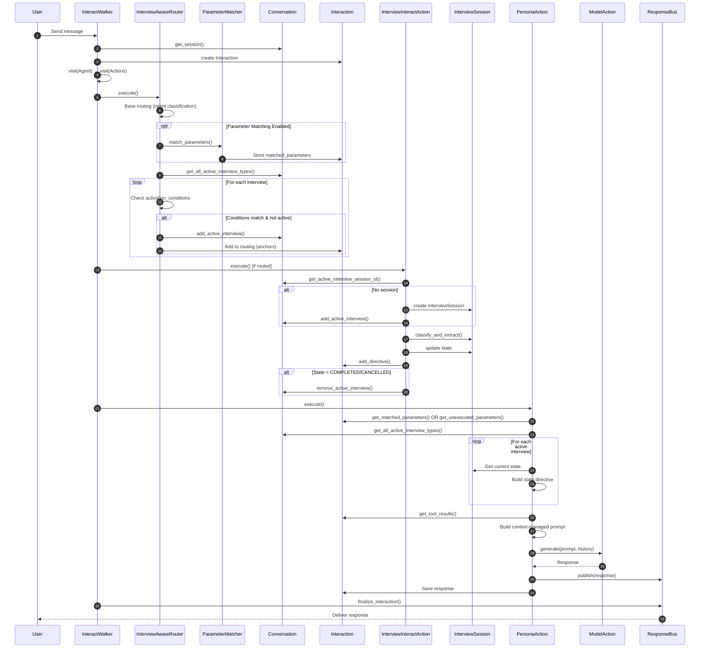
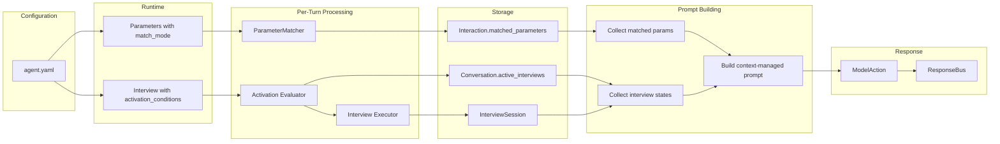
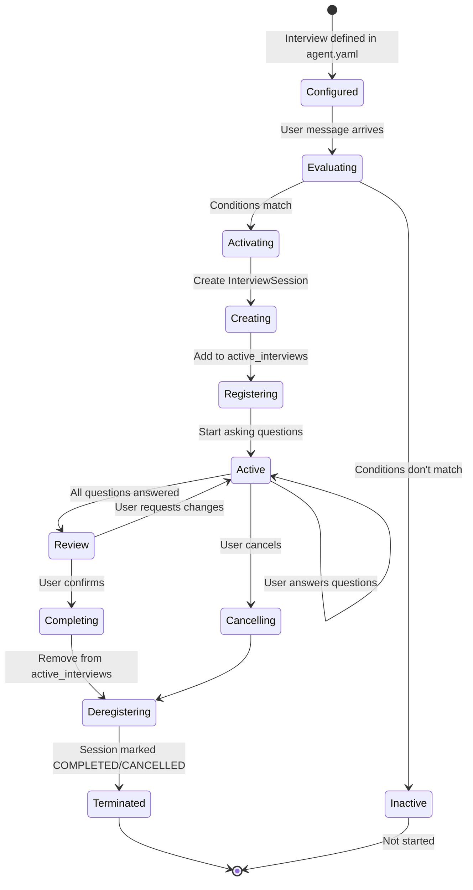
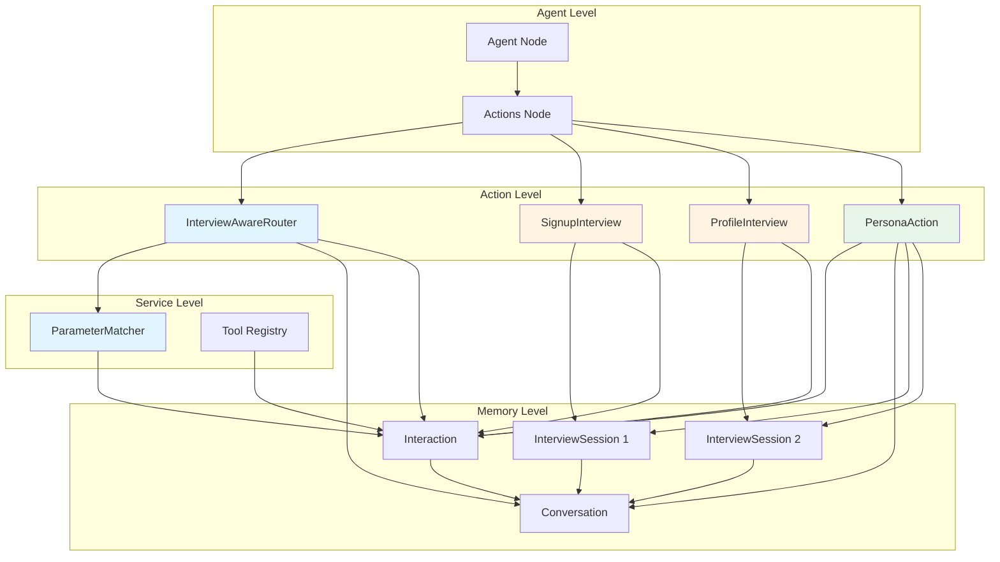
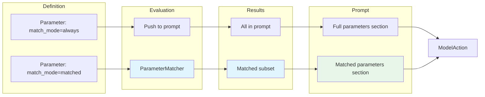
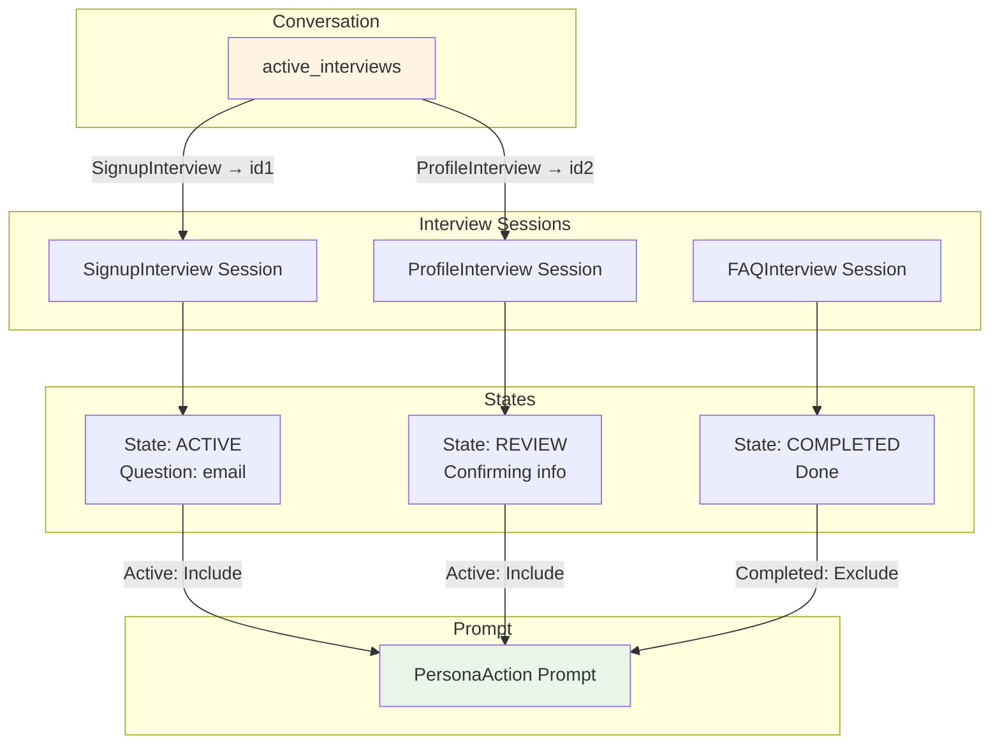
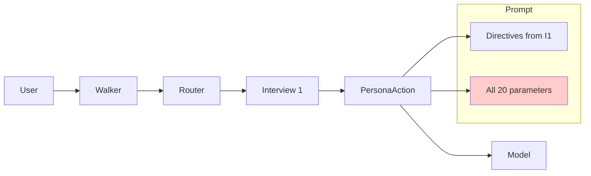
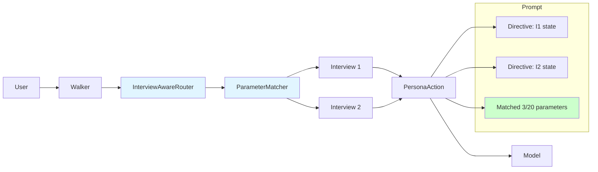
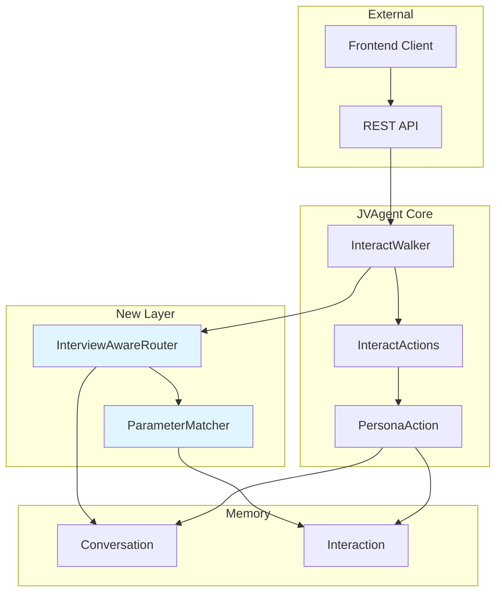

# System Diagram: Multi-Interview Architecture

## Complete System Overview

## Request Flow Detail

## Data Flow

## Interview Lifecycle

## Component Relationships

## Parameter Flow

## Multi-Interview State

## Comparison: Before vs After

### Before (Single Interview, All Parameters)

### After (Multi-Interview, Matched Parameters)

The prompt is **smaller** and **more focused**, leading to better responses.

## Integration Points

The new layer integrates seamlessly with existing components without requiring changes to the core walker, actions, or response pipeline.
