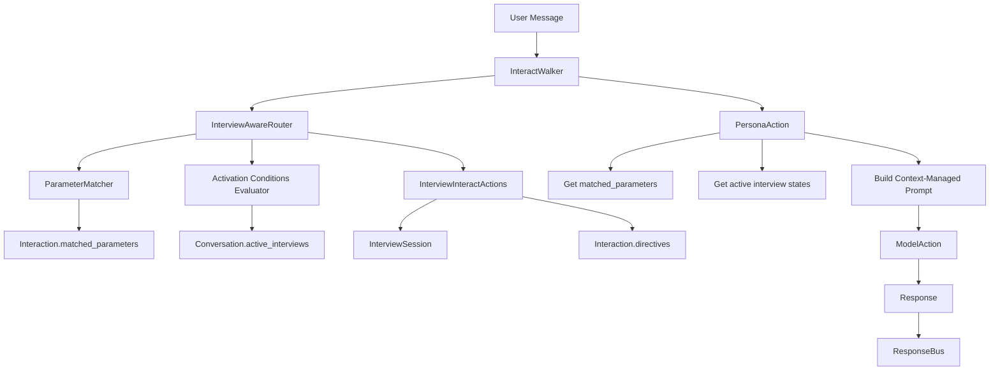
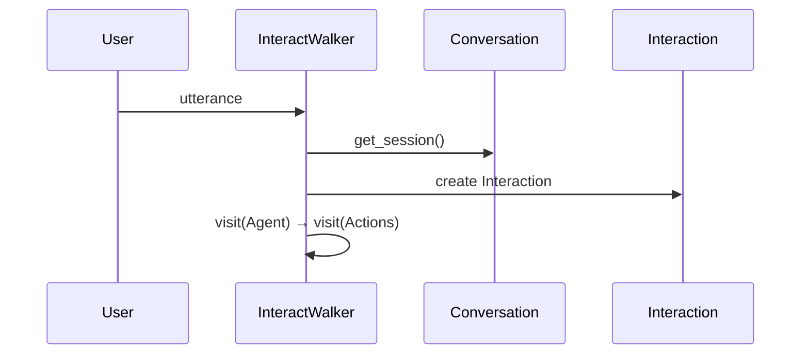
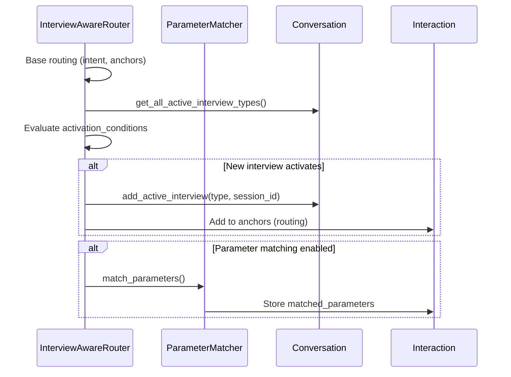
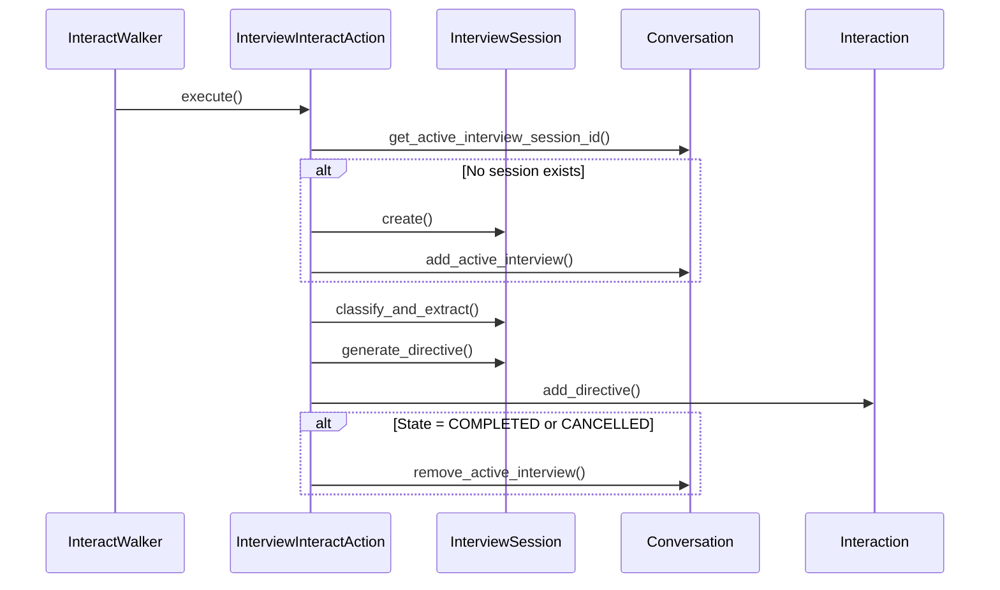
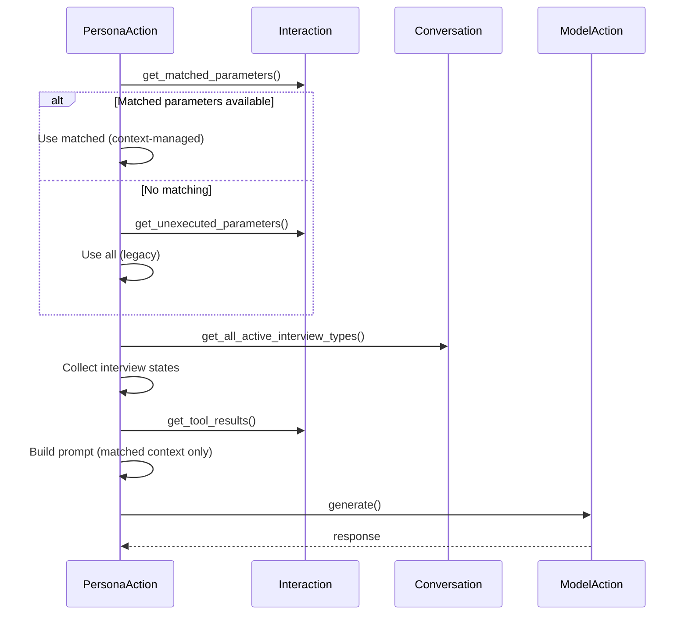
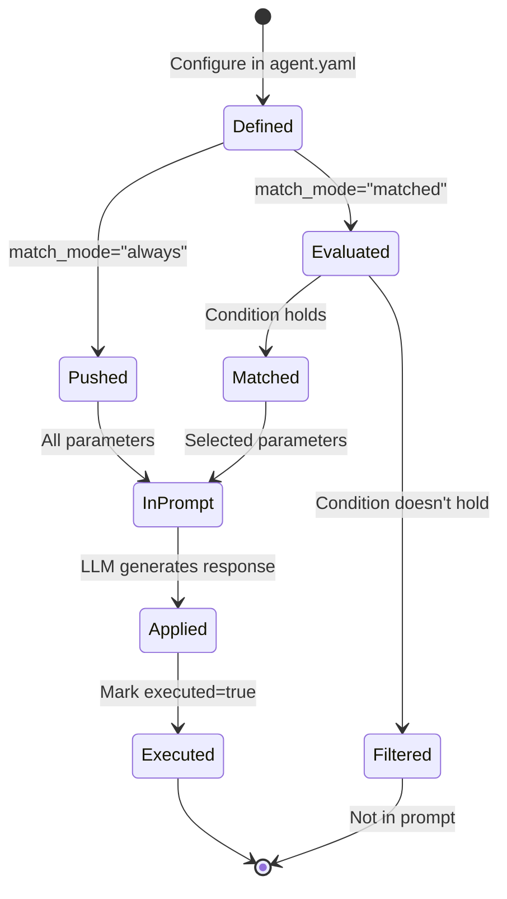
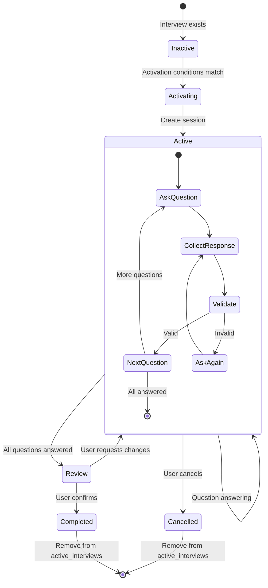

# Multi-Interview Architecture

This document describes the architecture of the parameter matching and multi-interview system.

## High-Level Architecture



## Component Interaction

### 1. Request Entry



### 2. Interview-Aware Routing (Optional)



### 3. Interview Execution



### 4. Context-Managed Response



## Data Flow

### Parameter Lifecycle



### Interview Lifecycle



## Storage Schema

### Interaction

```python
{
    # Existing fields...
    "utterance": str,
    "directives": List[Dict],
    "parameters": List[Dict],
    "response": str,
    
    # New fields
    "matched_parameters": List[Dict],  # Subset of parameters that matched
    "tool_results": List[Dict],        # Results from parameter-bound tools
}
```

### Conversation

```python
{
    # Existing fields...
    "session_id": str,
    "user_id": str,
    "context": Dict,
    
    # New field
    "active_interviews": Dict[str, str],  # interview_type → session_id
}
```

### Parameter Schema

```python
{
    # Existing
    "condition": str,
    "response": str,
    "action_name": str,
    "executed": bool,
    
    # New optional
    "match_mode": "always" | "matched",
    "tools": List[str],
    "reevaluate_after": List[str],
    "interview_scope": str,
    
    # Added by matcher
    "_match_score": float,
    "_match_rationale": str,
}
```

## Extensibility

### Custom Matching Strategies

Implement custom parameter matching:

```python
from jvagent.action.parameter.matcher import ParameterMatcher

class CustomMatcher(ParameterMatcher):
    async def _match_rule_based(self, parameters, interaction, conversation):
        # Your custom logic
        return results
```

### Custom Interview Activation

Implement custom activation logic:

```python
from jvagent.action.router.interview_aware_router import InterviewAwareRouter

class CustomInterviewRouter(InterviewAwareRouter):
    async def _should_activate_interview(self, interview, interaction, conversation):
        # Your custom logic
        return True/False
```

## Performance Considerations

### Parameter Matching

- Rule-based: O(n) where n = number of parameters with match_mode="matched"
- LLM-based (future): Single LLM call per turn, batches all parameters
- Hybrid (future): Quick rule filter + LLM for ambiguous cases

### Multi-Interview Tracking

- O(1) lookup: `conversation.active_interviews` is a dict
- O(k) state collection where k = number of active interviews
- Typical: 1-3 active interviews per conversation

### Prompt Size

Before (all parameters):
```
Parameters: 20 total → 20 in prompt (always)
```

After (matched parameters):
```
Parameters: 20 total → 3-5 matched → 3-5 in prompt (context-managed)
```

Reduction: 60-75% fewer parameters per prompt, lower cost and better attention.

## Integration Points

### With InteractRouter

```python
# Standard router (unchanged)
InteractRouter → classify intent → select actions

# Interview-aware router (extends)
InterviewAwareRouter → base routing → check interviews → match parameters
```

### With PersonaAction

```python
# Before
PersonaAction → get_unexecuted_parameters() → all in prompt

# After (when matching used)
PersonaAction → get_matched_parameters() → only relevant in prompt
PersonaAction → collect active interview states → include in prompt
PersonaAction → get_tool_results() → include in prompt
```

### With Interview System

```python
# Before
Single InterviewSession per action type

# After
Multiple InterviewSessions per Conversation
Tracked in conversation.active_interviews
Each contributes state to prompt
```

## Testing Strategy

1. **Unit tests**: ParameterMatcher logic, filtering, scope checking
2. **Integration tests**: Router + matcher + persona flow
3. **System tests**: Full multi-interview scenarios
4. **Backward compatibility tests**: Ensure legacy behavior preserved

## Future Enhancements

### Phase 6: Parameter-Bound Tool Execution

- Execute tools attached to matched parameters
- Re-run ParameterMatcher after tool execution (if reevaluate_after)
- Preparation loop: match → tools → re-match → respond
- Max iterations cap to prevent infinite loops

### LLM-Based Matching

- Single LLM call to evaluate all parameter conditions
- Return match scores and rationales
- More sophisticated condition evaluation

### Event Log

- Add event timeline to Conversation (like Parlant's sessions)
- Support multi-message batching
- Trace IDs for linking messages to tool calls

### Advanced Interview State

- Rich state summaries for prompt context
- Interview progress indicators
- Cross-interview dependency tracking
