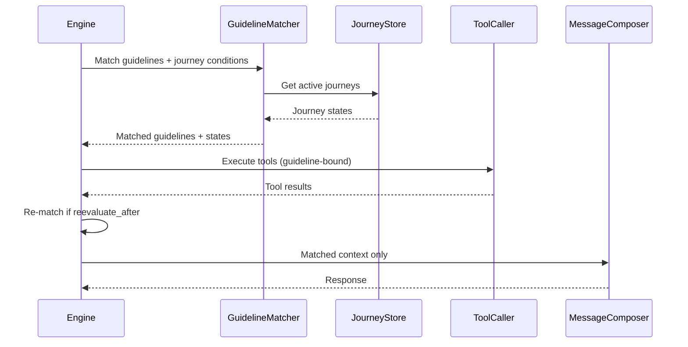
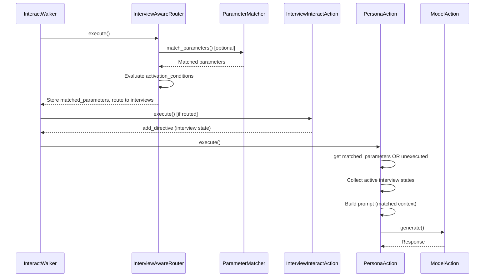

# Comparison: Parlant vs JVAgent Architecture

This document compares Parlant's architecture with jvagent's implementation after the multi-interview refactor.

## Terminology Mapping

| Parlant | JVAgent | Notes |
|---------|---------|-------|
| Guideline | Parameter | `{condition, action/response}` structure |
| GuidelineMatcher | ParameterMatcher | Selects applicable items per turn |
| Journey | InterviewInteractAction | State diagram with conditional flow |
| Journey Session | InterviewSession | Tracks state, responses, position |
| Chat State | QuestionNode | Question to ask, response to collect |
| Tool State | (via parameter tools) | Tool execution when parameter matches |
| Fork State | QuestionNode with branches | Conditional branching |
| Journey Conditions | activation_conditions | When interview should activate |
| Coexisting Journeys | Multiple active_interviews | Multiple InterviewSessions per Conversation |

## Architecture Comparison

### Parlant Flow



### JVAgent Flow (After Refactor)



## Feature Parity Matrix

| Feature | Parlant | JVAgent | Status |
|---------|---------|---------|--------|
| Conditional instructions | Guidelines | Parameters | ✅ Equivalent |
| Per-turn selection | GuidelineMatcher | ParameterMatcher | ✅ Implemented |
| State diagrams | Journeys | InterviewInteractAction | ✅ Equivalent |
| State tracking | Journey Session | InterviewSession | ✅ Equivalent |
| Multiple coexisting flows | ✅ | ✅ via active_interviews | ✅ Implemented |
| Activation conditions | Journey conditions | activation_conditions | ✅ Implemented |
| Scope filtering | Journey-scoped guidelines | interview_scope | ✅ Implemented |
| Tool binding | Guideline → tools | Parameter → tools | ✅ Schema ready |
| Tool execution | ✅ In preparation loop | ⏳ Foundation built | 🔄 In progress |
| Re-matching after tools | ✅ reevaluate_after | ⏳ Schema ready | 🔄 Planned |
| Context management | ✅ Load matched only | ✅ Use matched_parameters | ✅ Implemented |
| Event timeline | ✅ Session events | ⏳ Planned | 🔮 Future |
| Multi-message batch | ✅ | ⏳ Planned | 🔮 Future |

## Prompt Comparison

### Parlant Prompt Structure

```
### AGENT IDENTITY
{agent description}

### MATCHED GUIDELINES
{guideline 1: condition + action}
{guideline 2: condition + action}

### ACTIVE JOURNEYS
Journey 1: State X - instruction
Journey 2: State Y - instruction

### TOOL RESULTS
{tool results from this turn}

### CONVERSATION HISTORY
{history}
```

### JVAgent Prompt Structure (After Refactor)

```
### AGENT IDENTITY
{agent description}

### DIRECTIVES (from InteractActions)
{directive 1}
{directive 2}

### ACTIVE INTERVIEWS
Interview 1: State ACTIVE - instruction
Interview 2: State REVIEW - instruction

### PARAMETERS (matched for this turn)
{parameter 1: condition + response}
{parameter 2: condition + response}

### TOOL RESULTS
{tool results from this turn}

### CONVERSATION HISTORY
{history}
```

## Key Differences

### 1. Execution Model

**Parlant**: Engine-centric
- Single entry point (Engine.process)
- Engine orchestrates all phases
- Tools called by engine, not by "actions"

**JVAgent**: Walker-centric
- InteractWalker traverses action graph
- Each InteractAction has autonomy
- Tools can be called by actions OR via parameter matching

### 2. Instruction Sources

**Parlant**: Matched only
- All instructions come from GuidelineMatcher + JourneyStateMatcher
- Nothing is "always included"

**JVAgent**: Hybrid
- Directives: Pushed by InteractActions (always)
- Parameters: Can be pushed (always) OR matched (when relevant)
- Interviews: Contribute state directives (when active)

This hybrid approach preserves jvagent's flexibility for non-guideline use cases.

### 3. Journey Implementation

**Parlant**: Lightweight
- Journeys are data (state graph in DB)
- Engine traverses state graph
- No "action" per journey

**JVAgent**: Action-centric
- Each InterviewInteractAction IS a journey
- Implements execute() with full logic
- Can use QuestionWalker for state selection
- More heavyweight but more flexible

### 4. Router Role

**Parlant**: No router
- Engine directly loads and matches guidelines
- Journey conditions part of matching

**JVAgent**: Router as traffic controller
- InteractRouter selects which actions run
- InterviewAwareRouter adds interview logic
- Keeps routing separate from execution

## Design Decisions

### 1. Why Not Replace InteractActions with "Guidelines Only"?

JVAgent's InteractAction model provides:
- Custom execution logic (not just condition/action strings)
- Direct tool calling and API integration
- Flexibility for non-conversational flows
- Graph-based composition and reuse

The refactor **layers** guideline-like matching on top rather than replacing the foundation.

### 2. Why Keep Directives Separate from Parameters?

- **Directives**: Immediate, action-specific instructions (pushed)
- **Parameters**: General conditional guidance (can be matched)

This separation allows:
- InterviewInteractActions to issue directives (current state instruction)
- PersonaAction to have general parameters (conversational principles)
- Parameter matching to reduce prompt size without losing directive specificity

### 3. Why InterviewSession, Not "JourneySession"?

- Maintains jvagent terminology
- InterviewSession already has everything needed
- No conceptual difference from Parlant's journey session
- Avoids confusion with renaming existing, working code

## Similarities to Parlant

1. **Context Management**: Only matched parameters in prompt (like matched guidelines)
2. **Coexisting Journeys**: Multiple interviews active simultaneously
3. **State Selection**: QuestionWalker is like journey state selector
4. **Scope Filtering**: interview_scope like journey-scoped guidelines
5. **Activation**: activation_conditions like journey conditions

## Unique to JVAgent

1. **Action Graph**: Composable InteractAction graph (vs. engine-centric)
2. **Directive Push**: InteractActions can push directives (vs. all matched)
3. **Router Autonomy**: InteractRouter is pluggable (vs. built into engine)
4. **Interview Flexibility**: Each interview is a full action with custom logic

## When to Use Which Feature

| Use Case | Recommended Approach |
|----------|---------------------|
| Simple chatbot | PersonaAction with always-mode parameters only |
| Structured data collection | Single InterviewInteractAction (current approach) |
| Multi-task agent | InterviewAwareRouter + activation_conditions |
| Complex conditional behavior | Parameters with match_mode="matched" |
| Parallel conversations | Multiple interviews with exclusive=false |
| Context switching | Exclusive interviews OR separate conversations |

## Migration from Parlant

If you're familiar with Parlant and want to build similar agents in jvagent:

| Parlant Pattern | JVAgent Equivalent |
|-----------------|-------------------|
| `agent.create_guideline(condition, action)` | Add parameter with `match_mode="matched"` |
| `agent.create_journey(title, conditions)` | Create InterviewInteractAction with `activation_conditions` |
| `journey.initial_state.transition_to(chat_state)` | QuestionNode in question_graph |
| `state.transition_to(tool_state=tool)` | Add `tools` to parameter |
| `guideline.reevaluate_after(tool)` | Add `reevaluate_after` to parameter |
| `journey.create_guideline(...)` | Add parameter with `interview_scope` |
| Multiple journeys active | Multiple interviews in `active_interviews` |

The key insight: jvagent provides the same capabilities through its action-based architecture rather than an engine-centric model.
